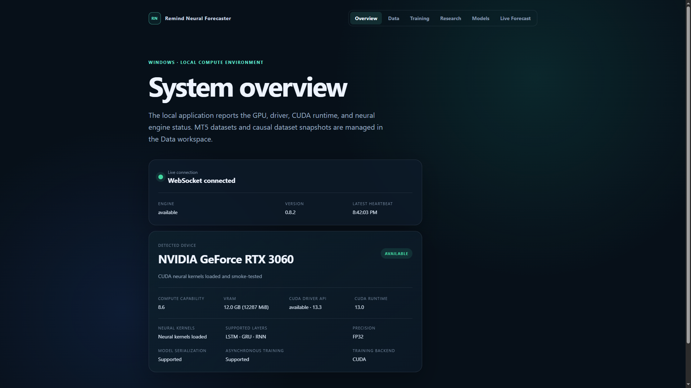

# GitHub copy for Remind Neural Forecaster

## Short description

Local C++20/CUDA Windows research app for MT5 datasets, causal snapshots,
recurrent-network training, out-of-sample evaluation and informational live
forecasts.

## GitHub About

Loopback-only Windows neural forecasting workspace with an embedded web UI,
versioned MT5 ingest, LSTM/GRU/RNN CUDA training, Model Registry and recoverable
artifact catalogs. No external ML framework and no automated trading.

## Suggested topics

`cpp20` `cuda` `cmake` `windows` `meta-trader-5` `mql5` `lstm` `gru` `rnn`
`time-series` `machine-learning` `local-first` `websocket` `forecasting`

## Repository introduction

Remind Neural Forecaster is a local Windows research application that receives
closed-bar data from MetaTrader 5, builds immutable causal dataset snapshots,
trains LSTM/GRU/RNN models on CUDA, evaluates the best checkpoint on an untouched
Test split and publishes informational multi-horizon High/Low forecasts.

The product remains one C++20 executable with an embedded web interface and a
loopback-only REST/WebSocket server. The optional CUDA core uses the CUDA
Runtime, cuBLAS and cuRAND directly—without TensorFlow, PyTorch, cuDNN or WebGPU.
A no-CUDA build remains available and reports GPU functions unavailable rather
than emulating them.

Version 0.8.2 adds human-readable snapshot and experiment names plus
dependency-aware deletion, app-local trash, Restore, confirmed Permanent Purge
and restart recovery. Immutable IDs and content hashes do not change.

## Suggested release summary

**0.8.2 — readable catalogs and recoverable deletion**

- editable, collision-safe display names;
- names across Data, Training, Research, Models and Live Forecast;
- dependency preview and HTTP 409 conflicts;
- non-cascading delete by default;
- transactional app-local trash with Restore;
- separately confirmed Permanent Purge;
- crash/restart recovery and legacy catalog compatibility;
- verified CUDA and no-CUDA Release matrices.

## Accuracy and scope statement

Forecasts are informational research outputs. The software does not place
orders and does not guarantee accuracy, profitability or unattended production
readiness. Signed packaging and broader release hardening remain roadmap work.

