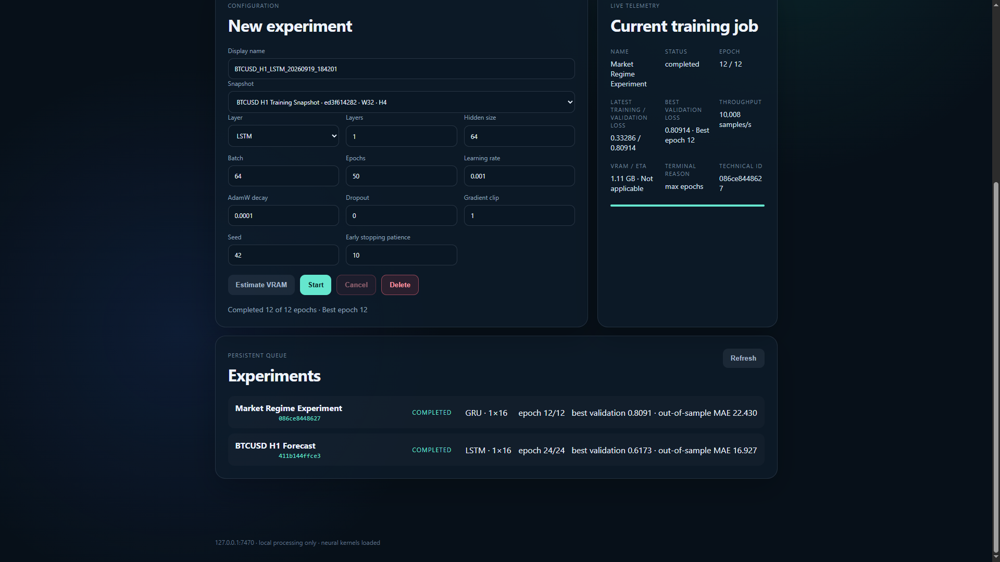
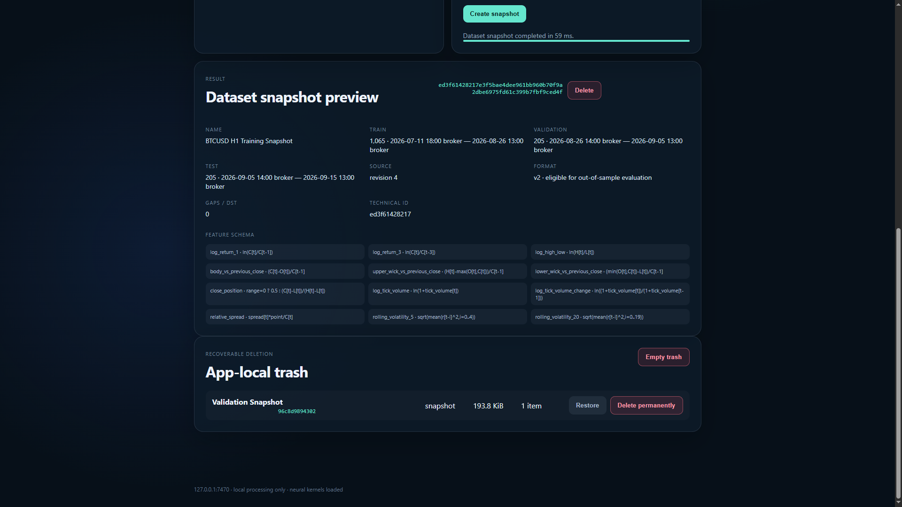
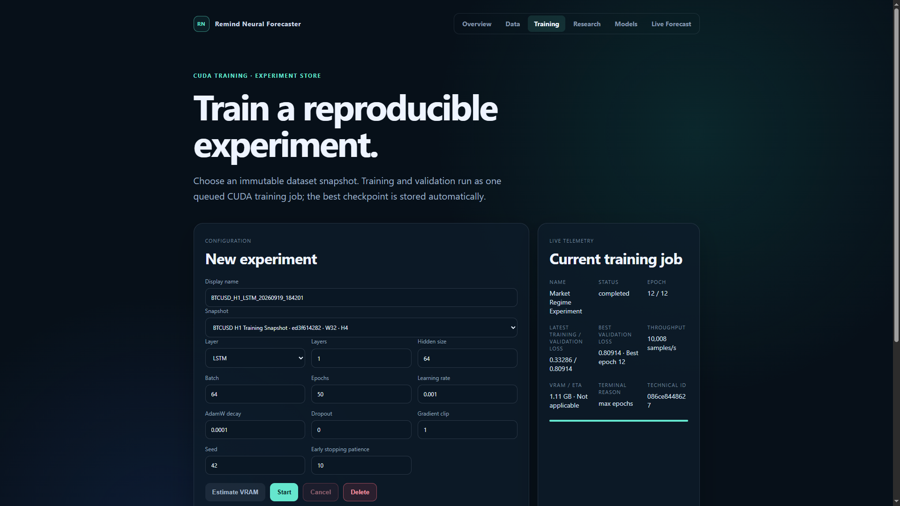
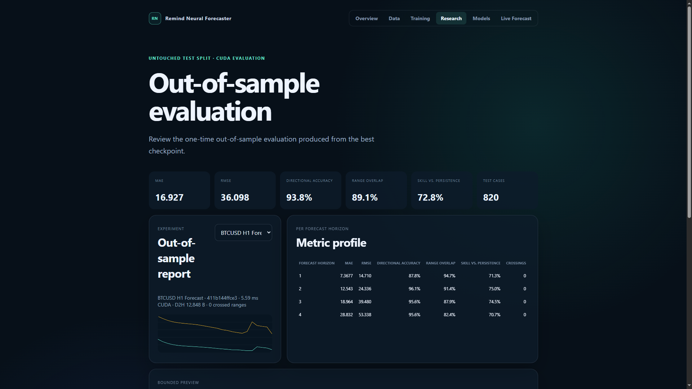
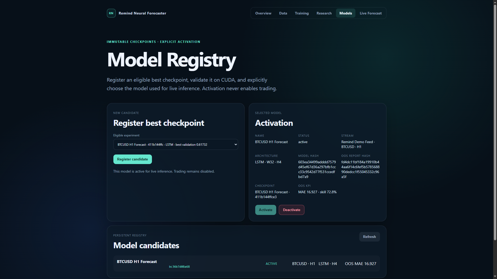

# Remind Neural Forecaster 0.8.2

## Lokální CUDA výzkumné prostředí pro data z MetaTraderu 5

Remind Neural Forecaster spojuje příjem uzavřených MT5 barů, reprodukovatelnou
datovou přípravu, CUDA trénování rekurentních sítí, out-of-sample vyhodnocení a
živou informativní predikci v jedné lokální aplikaci pro Windows.

Data, modely i forecasty zůstávají na počítači uživatele. Aplikace naslouchá
pouze na `127.0.0.1:7470`, webové rozhraní je vložené přímo v EXE a žádná její
část automaticky neobchoduje.

## Co aplikace řeší

Práce s časovými řadami není jen spuštění neuronové sítě. Je potřeba zachovat
identitu feedu, chronologii, kauzalitu, hranice datasetu, normalizaci a vazbu
mezi experimentem, checkpointem a vyhodnocením. Forecaster tyto kroky drží v
jednom verzovaném lokálním workflow:

1. EA_Forecaster posílá historické a nově uzavřené bary z MT5.
2. Dataset Store zachovává oddělené feedy podle brokera, symbolu, timeframe a
   verze schématu.
3. Uživatel vytvoří neměnný snapshot s kauzálními features, cíli a
   chronologickým Train/Validation/Test rozdělením.
4. CUDA worker zařadí experiment do jediné GPU fronty, trénuje LSTM, GRU nebo
   RNN a uloží nejlepší validační checkpoint.
5. Nejlepší checkpoint je právě jednou vyhodnocen na nedotčeném test splitu.
6. Způsobilý checkpoint lze explicitně registrovat a aktivovat pro živou CUDA
   inferenci. Aktivace nikdy nezapíná obchodování.

## Přehledné katalogy a názvy

Verze 0.8.2 zavádí samostatné `displayName` pro snapshoty a experimenty.
Výchozí názvy vycházejí ze symbolu, timeframe, architektury a UTC času, například
`BTCUSD_M5_LSTM_20260914_035000`. Uživatel je může před vytvořením upravit.

Interní fingerprinty, hashe, vazby a názvy binárních artefaktů se nemění.
Kolize názvů se řeší deterministickými suffixy `_2`, `_3` a technické ID zůstává
v UI dostupné jako sekundární údaj.

## Bezpečné mazání, Restore a Permanent Purge

Mazání je navrženo jako explicitní proces, nikoli jako skrytá kaskáda:

- preview předem ukáže velikost, závislosti, blokátory a přesný rozsah;
- dataset blokují jeho snapshoty, snapshot blokují experimenty a experiment
  blokují registrované modely nebo aktivní práce;
- kaskádové smazání musí uživatel výslovně zvolit;
- aktivní nebo validovaný model zůstává vždy blokující;
- artefakty se nejprve přesunou do interního lokálního koše;
- Restore znovu ověří metadata a katalogové vazby;
- Permanent Purge vyžaduje druhé potvrzení.

Checksummovaný manifest a transakční přesuny souborů podporují obnovu po
přerušení procesu. Rozpracovaný purge se po restartu vrací do koše, nikoli do
živého katalogu.

## CUDA trénování a numerická kontrola

CUDA build používá interní C++/CUDA jádro bez TensorFlow, PyTorch, cuDNN nebo
WebGPU. Implementované vrstvy jsou LSTM, GRU a RNN; trénování používá AdamW,
gradient clipping a dropout. Parametry, gradienty a optimizer state zůstávají
po dobu trénování ve VRAM a data se do GPU nahrají jednou.

Nezávislá CPU reference ověřuje forward průchod, BPTT, gradienty a parity testy.
Trénink je deterministicky řízen seedem a snapshot fingerprintem v rámci
definovaných FP32 tolerancí. Na stroji bez CUDA se sestaví stejná lokální
aplikace, ale capabilities a Training API korektně oznámí nedostupný GPU backend.

## Out-of-sample výzkum

Test split se nepoužívá pro early stopping, volbu checkpointu ani konfiguraci.
Po ukončení trénování se nejlepší validační checkpoint vyhodnotí právě jednou.
Research workspace zobrazuje agregované i per-horizon MAE, RMSE, directional
accuracy, range overlap, skill vs. persistence a počet testovacích případů.

Report `RNFOOS01` je checksummovaný a svázaný s experimentem, snapshotem,
konfigurací a hashem modelu. Náhled predikcí je záměrně omezený.

## Model Registry a živá inference

Dokončený nebo early-stopped experiment se může stát immutable kandidátem.
Registrace ani aktivace není automatická. Aktivace asynchronně ověří checkpoint,
report, snapshot, schémata, scalery a hash, načte samostatný CUDA inference model
a provede deterministický smoke test. Teprve potom atomicky přepne aktivní model.

Po potvrzeném novém uzavřeném baru vznikne multi-horizon High/Low/Midpoint
forecast. Duplicita nevytváří novou predikci, korekce baru vytváří predikci pro
novou revizi a omezená fronta slučuje zastaralé požadavky. Výsledek je
informativní; server ani EA nevytváří obchodní příkazy.

## Lokální bezpečnost a integrita

- HTTP server je pevně svázán s IPv4 loopback rozhraním.
- Browserové mutace vyžadují session cookie a přesný Origin.
- MT5 používá oddělený instalační token, který není v URL ani logu.
- Formáty datasetů, snapshotů, modelů, reportů, forecastů a koše používají
  explicitní verze, limity a SHA-256.
- Atomické zápisy používají dočasný soubor a replace/write-through publikaci.
- Server odmítá zkrácená, poškozená, nadlimitní a nekonzistentní data před
  publikací do živého stavu.

## Architektura

- C++20 a CMake 3.28+
- jeden produktový `RemindNeuralForecaster.exe`
- vložené HTML/CSS/JavaScript rozhraní
- lokální REST API a zabezpečený WebSocket
- asynchronní server, snapshot, training, evaluation, activation a inference
  workery
- volitelné interní statické CUDA jádro
- CUDA Runtime staticky linkovaný; ověřený CUDA 13 build používá runtime DLL
  `cublas64_13.dll` a `curand64_10.dll`

## Aktuální stav 0.8.2

Implementovány jsou milníky 1–8C včetně MT5 backfillu, kauzálních snapshotů,
CUDA trénování, out-of-sample reportů, Model Registry, živé inference,
display names a obnovitelného mazání. Release hardening, instalátor, podepisování
a širší distribuční proces jsou plánovány v milníku 9.

Forecaster je výzkumný nástroj. Výsledky nejsou investiční doporučení a aplikace
neslibuje přesnost ani ziskovost predikcí.

